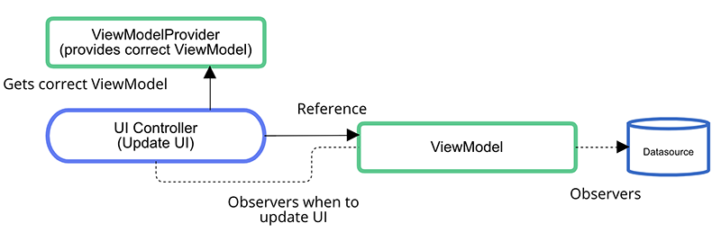

# Android Architecture Components Extensions Legacy
[]()


This is the Android Architecture Components extension library available for kotlin.

I used kotlin infix notation for the following code.

```
ViewModelProviders.of(this, object : ViewModelProvider.Factory {
    override fun <T : ViewModel?> create(modelClass: Class<T>?): T {
        return MyViewModel(..., ..., ...) as T
    }
}).get(MyViewModel::class.java)
```


## Library version

It can be used jcenter(), as follows

[  ](https://bintray.com/taehwandev/thdev.tech/lifecycle-extensions-legacy/_latestVersion)

```
implementation 'org.jetbrains.kotlin:kotlin-stdlib-jdk7:1.3.0'
implementation 'com.android.support:appcompat-v7:27.1.1'

implementation 'android.arch.lifecycle:extensions:1.1.1'
implementation "tech.thdev.lifecycle:lifecycle-extensions-legacy:$latestLegacyVersion"
```


## Diagram




## Blog

한글 Post - [Android Architecture Components ViewModel을 간단하게 초기화 하려면?](https://thdev.tech/androiddev/2018/08/05/Android-Architecture-Components-ViewModel-Inject/)


## Use api - by lazy patten

Use lazy initialization

### Activity inject

Use cache activity

```kotlin
class MainActivity : AppCompatActivity() {

    private val myViewModel: MyViewModel
            by lazyInject(/* @Option customKey = "custom key" */) {
        // create Your ViewModel
        MyViewModel(..., ..., ...)
    }

    override fun onCreate(savedInstanceState: Bundle?) {
       // Maybe init view model
       myViewModel ...
    }
}
```

### Fragment inject

Use cache fragment

```kotlin
class MainFragment : Fragment() {

    private val myViewModel: MyViewModel
            by lazyInject(/* @Option customKey = "custom key" */) {
        // create Your ViewModel
        MyViewModel(..., ..., ...)
    }

    override fun onActivityCreated(savedInstanceState: Bundle?) {
        super.onActivityCreated(savedInstanceState)

        // Maybe init view model
        myViewModel ...
    }
}
```

### Fragment - use activity inject

Use cache activity

```kotlin
class MainFragment : Fragment() {

    private val myViewModel: MyViewModel
            by lazyInject(isActivity = true /* @Option , customKey = "custom key" */) {
        // create Your ViewModel
        MyViewModel(..., ..., ...)
    }

    override fun onActivityCreated(savedInstanceState: Bundle?) {
        super.onActivityCreated(savedInstanceState)

        // Maybe init view model
        myViewModel ...
    }
}
```


## Use api - by inject only kotlin.

Used initializing lateinit.

### Activity inject

Use cache activity

```kotlin
class MainActivity : AppCompatActivity() {

    private lateinit var myViewModel: MyViewModel

    override fun onCreate(savedInstanceState: Bundle?) {
        // ...
        myViewModel = inject(/* @Option customKey = "custom key" */) {
            // create Your ViewModel
            MyViewModel(..., ..., ...)
        }.run {
            // Maybe init view model
        }
    }
}
```

### Fragment inject

Use cache fragment

```kotlin
class MainFragment : Fragment() {

    private lateinit var myViewModel: MyViewModel

    override fun onActivityCreated(savedInstanceState: Bundle?) {
        super.onActivityCreated(savedInstanceState)

        myViewModel = inject(/* @Option customKey = "custom key" */) {
            // create Your ViewModel
            MyViewModel(..., ..., ...)
        }.run {
            // Maybe init view model
        }
    }
}
```

### Fragment - use activity inject

Use cache activity

```kotlin
class MainFragment : Fragment() {

    private lateinit var myViewModel: MyViewModel

    override fun onActivityCreated(savedInstanceState: Bundle?) {
        super.onActivityCreated(savedInstanceState)

        myViewModel = requireActivity().inject(
                /* @Option customKey = "custom key" */) {
            // create Your ViewModel
            MyViewModel(..., ..., ...)
        }.run {
            // Maybe init view model
        }
    }
}
```

## Use api - by inject only Java.

Use java

### Activity inject

Use cache activity

```java
public class MainActivity extends AppCompatActivity {

    private MyViewModel myViewModel;

    @Override
    protected void onCreate(@Nullable Bundle savedInstanceState) {
        super.onCreate(savedInstanceState);

        myViewModel = ViewModelExtensions.inject(
                this,
                MyViewModel.class /*, @Option "custom key" */,
                new ViewModelHelper<MyViewModel>() {

            @NotNull
            @Override
            public MyViewModel onCreateViewModel() {
                return new MyViewModel(..., ..., ...);
            }
        });
    }
}
```

### Fragment inject

Use cache fragment

```java
public class Sample extends Fragment {

    private MyViewModel myViewModel;

    @Override
    public void onActivityCreated(@Nullable Bundle savedInstanceState) {
        super.onActivityCreated(savedInstanceState);

        myViewModel = ViewModelExtensions.inject(
                this,
                MyViewModel.class /*, @Option "custom key" */,
                new ViewModelHelper<MyViewModel>() {

            @NotNull
            @Override
            public MyViewModel onCreateViewModel() {
                return new MyViewModel(..., ..., ...);
            }
        });
    }
}
```

### Fragment - use activity inject

Use cache activity

```java
public class Sample extends Fragment {

    private MyViewModel myViewModel;

    @Override
    public void onActivityCreated(@Nullable Bundle savedInstanceState) {
        super.onActivityCreated(savedInstanceState);

        myViewModel = ViewModelExtensions.injectViewModel(
                requireActivity(),
                MyViewModel.class /*, @Option "custom key" */,
                new ViewModelHelper<MyViewModel>() {

            @NotNull
            @Override
            public MyViewModel onCreateViewModel() {
                return new MyViewModel(..., ..., ...);
            }
        });
    }
}
```


## License

```
Copyright 2018 Tae-hwan

Licensed under the Apache License, Version 2.0 (the "License");
you may not use this file except in compliance with the License.
You may obtain a copy of the License at

   http://www.apache.org/licenses/LICENSE-2.0

Unless required by applicable law or agreed to in writing, software
distributed under the License is distributed on an "AS IS" BASIS,
WITHOUT WARRANTIES OR CONDITIONS OF ANY KIND, either express or implied.
See the License for the specific language governing permissions and
limitations under the License.
```
